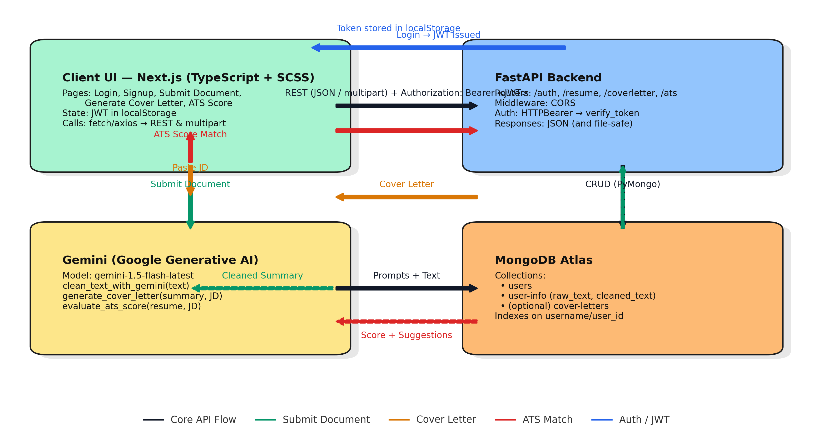

# EasyApply.ai

AI-assisted job application toolkit: upload or paste your resume, clean & summarize it with Gemini, track applications, and generate tailored cover letters from a pasted JD. Includes an ATS score match feature (JD + resume) with improvement suggestions.

---

## Features

- **Auth:** Signup/Login (JWT), Logout, protected routes  
- **Resume ingestion:** PDF/text upload or manual paste → stored as `raw_text` + `cleaned_text`  
- **Gemini processing:**
  - `clean_text_with_gemini()` – de-noise & summarize resume  
  - `generate_cover_letter()` – personalized letter from JD + your summary  
  - `evaluate_ats_score()` – score + suggestions (ATS Match)  
- **Cover Letter UI:** paste JD → generated letter  
- **ATS Score Match UI:** paste JD + upload resume → score + recommendations  
- **Application tracker:** (scaffolded)  
- **Nice UX:** dynamic header, hamburger menu (protected links), session expiry auto-logout

---

## Tech Stack

### Frontend
- Next.js (Pages Router), TypeScript, SCSS modules  
- `fetch` / `axios` to FastAPI  
- JWT stored in `localStorage`

### Backend
- FastAPI (Python)  
- Routers: `auth`, `resume`, `coverletter`, `atsmatch`  
- Auth: HTTPBearer + JWT (`verify_token`)  
- CORS middleware enabled

### AI
- Google Gemini (`google-generativeai`)  
- Models tested: `models/gemini-1.5-flash-latest` (for `generate_content`)

### Database
- MongoDB (Atlas) via PyMongo  
- **Collections:**
  - `users` — `{ username, password_hash, first_name, last_name, createdAt }`
  - `user-info` — `{ user_id, raw_text, cleaned_text, timestamps }`
  - *(optional)* `cover-letters` — store history if needed

---

## Architecture

